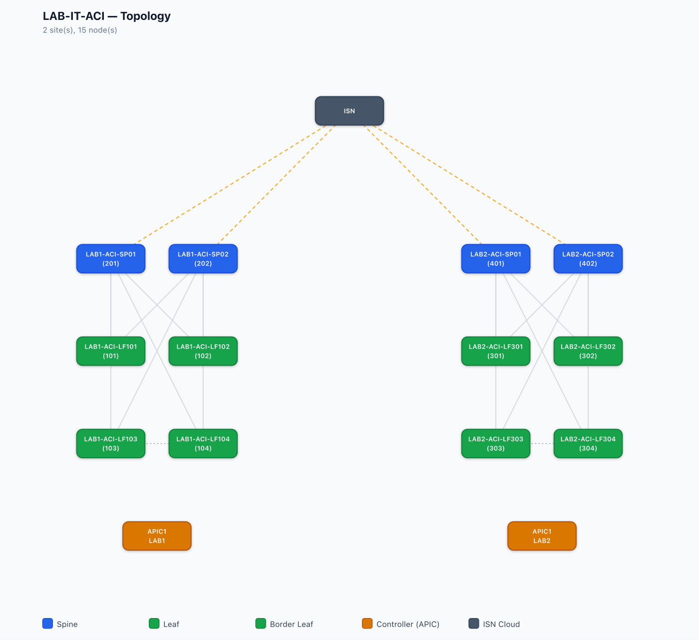

# aci-sim

A stateful, dependency-free REST simulator of a 2-site Cisco ACI/NDO fabric —
run Ansible `cisco.aci` playbooks, ACI SDKs, or an AI agent against it like
real gear, with no hardware required.

[](https://github.com/dtzp555-max/aci-sim/actions/workflows/ci.yml)
[](LICENSE)
[](https://buymeacoffee.com/dtzp555)
[](pyproject.toml)

A faithful REST **simulator of a 2-site Cisco ACI fabric** — a per-site APIC
plus a Nexus Dashboard Orchestrator (ND/NDO) plane — with no physical or
virtual ACI hardware required.

The sim answers the same URLs, response envelopes, and query semantics as a
real APIC / NDO, so anything that speaks the ACI/NDO REST API — Ansible's
`cisco.aci` collection, custom ACI clients/SDKs, CI pipelines, or an AI
coding agent poking around a "fabric" — runs against it unmodified. The
entire fabric — nodes, tenants, VRFs/BDs/EPGs, contracts, L3Outs, faults,
endpoints, and the whole NDO schema tree — is generated deterministically
from a single `topology.yaml`.

> **What it simulates (and what it doesn't):** aci-sim simulates the
> **management plane** — the REST API and the operational state a converged
> fabric would report. It does **not** run routing protocols: OSPF/BGP/LLDP
> state (`operSt=full`, `established`, adjacencies, /31 link addressing) is
> **materialized from configuration, not computed** — push the config and the
> matching operational MOs appear, exactly as your automation would read them
> off a healthy fabric. That's why the cisco.aci/cisco.mso collections and
> API clients work unmodified, and why the whole thing runs on a Raspberry
> Pi 4 — and also why it can't test convergence, failover timing, or actual
> traffic forwarding.



*A 2-site, 15-node fabric rendered by `aci-sim graph` — spines (blue),
leaves/border-leaves (green), controllers (amber), and the inter-site ISN
cloud (slate) — solid orange ISN uplinks, plus a physical-links table with
the /31 point-to-point ISN addressing. See §5's `aci-sim graph` for how to generate your own.*

**Platforms** — Linux (x86-64 & ARM: Raspberry Pi OS, Debian, Ubuntu — a
Raspberry Pi 4 is enough) and macOS (Apple Silicon & Intel). Python 3.11+.
The full test suite runs green on both. The default port mode runs anywhere
Python does; sandbox mode (real management IPs on `:443`) needs root and is
Linux/macOS only. Windows is untested.

### 60-second quickstart

```bash
pip install git+https://github.com/dtzp555-max/aci-sim.git
aci-sim run &
aci-sim query fabricNode        # shows the 7-node LAB1 fabric
```

That's it — no cert generation, no manual `aaaLogin`/cookie handling, no
clone required. See §4 for the full install/run options (including the
from-source/clone path needed for `scripts/`, `examples/`, and Ansible) and
§5 for the full `aci-sim` CLI reference.

---

## 1. Purpose

**What it simulates:** a 2-site Cisco ACI fabric (spines, leaves, border
leaves in vPC pairs, an inter-site ISN/EVPN mesh), one APIC REST API per
site, and one NDO/MSO REST plane tying the two sites together. All three
planes are derived from the same topology definition, so tenant/VRF/BD names
and IDs are guaranteed consistent between a site's APIC and NDO's view of it
— matching how a real multi-site deployment behaves.

The simulator implements a **99-class object catalog** (`docs/CONTRACT.md`
§6) spanning fabric/topology, faults, interfaces, underlay neighbors,
BGP-EVPN overlay, COOP/EPM, routing tables, tenant policy, contracts, L3Out,
access policy, and capacity/backup classes — the subset of the real ACI
object model that REST clients and Ansible's `cisco.aci` modules actually
read and write.

**Why it exists:**

- **Test Ansible `cisco.aci` playbooks** (tenant/VRF/BD/AP/EPG create,
  idempotency, teardown) without booking lab time on real or virtual ACI
  hardware. See `examples/ansible/`.
- **Develop and exercise ACI REST clients/SDKs** against faithful envelope
  shapes, filter grammar, pagination, and error codes — including edge cases
  (malformed filters, expired sessions, atomic write validation) that are
  tedious to provoke on a real controller.
- **CI gates** — spin the sim up in a GitHub Actions job, run integration
  tests against real HTTP, tear it down; no external dependency, no
  credentials to manage, fully deterministic. See `examples/ci/` for a
  copy-pasteable GitHub Actions gate + `assert_mit.py`, a tiny MIT-end-state
  assertion helper that fails the build when a change stops producing the
  objects it should.
- **AI-agent sandboxes** — a safe, disposable target for agents that need to
  "drive" an ACI/NDO-shaped API (query, write, verify) without touching
  production infrastructure. The `/_sim` control API (snapshot / restore /
  reset) makes a clean act-observe-reset eval harness; seeded faults let you
  test an agent's diagnosis path.
- **Training / demos** — a full 2-site fabric with faults, endpoints, and
  contracts to explore, with no hardware cost.

It was originally built to exercise a companion project, autoACI, end-to-end
without a lab; that contract is preserved (`docs/CONTRACT.md`), but the
simulator's REST surface is generic ACI/NDO — nothing in it is autoACI-
specific.

### More applications

The same "stateful management-plane, real REST, resettable" core supports a
few more scenarios — with an honest note on what each needs today:

| Use case | Status |
|---|---|
| **SDK / provider testing** (cobra, acitoolkit, terraform-provider-aci, custom Go/Python clients) | Ready — faithful envelope/DN/filter semantics |
| **Change pre-flight** — model a proposed change (new tenant, VLAN migration) against a sim seeded to mirror production, catch errors before touching real gear | Ready — this is what the production-var validation runs exercise |
| **REST-contract / regression testing** — pin the APIC/NDO REST behaviour your tooling depends on to a git-versioned target | Ready |
| **Multi-tool interop** — verify Ansible + Terraform + a Python script converge on the same MIT | Ready |
| **Monitoring/observability integration** — test a fault→alert pipeline or exporter against seeded faults/health | Ready — polling AND websocket **query subscriptions** (`?subscription=yes` + `/socket<token>` push-on-change) both work, see §10a |
| **Client scale/perf testing** — hammer pagination / large-MIT / concurrent queries | Needs a large-topology seed (extension) |

**Out of scope** (management-plane simulator, by design): the data plane
(packet forwarding, real VXLAN), real APIC software internals (upgrades,
cluster quorum), and live event-driven telemetry — operational objects
(faults, health, endpoints, routes) are synthesised from the topology at
build time, not generated from real events.

---

## 2. Architecture

### Module map

```
topology.yaml
     │  load_topology()               topology/loader.py + schema.py (Pydantic v2)
     ▼
  Topology
     │
     ├─ build_all(topo) ──► {site_name: MITStore}      build/orchestrator.py
     │     builders: fabric, cabling, underlay, overlay, interfaces,
     │               tenants, access, l3out, endpoints, routing,
     │               zoning, health_faults
     │
     └─ build_ndo_model(topo) ──► NdoState             ndo/model.py
           (names derived from the SAME topo → APIC/NDO consistency)

  make_apic_app(ApicSiteState) ──► FastAPI  (×2, one per site)   rest_aci/app.py
        ├─ query engine  (class / mo / node-scoped)              query/engine.py
        ├─ write handler (upsert + fabricNodeIdentP reaction)    rest_aci/writes.py
        └─ /_sim control router                                  control/admin.py

  make_ndo_app(NdoState) ──► FastAPI                             ndo/app.py

  runtime/supervisor.py  →  three uvicorn servers over TLS (asyncio.gather)
```

- **`mit/`** — the object store. `MO` (dn-keyed managed object with
  attrs/children) + `MITStore` (dn→MO map, parent→children index,
  deterministic insertion order). No dependencies — the foundation every
  other layer builds on.
- **`query/`** — the ACI query engine: `filters.py` parses
  `eq/wcard/and/or/gt/lt/ge/le/bw(...)` filter expressions into predicates;
  `engine.py` implements the three query shapes (class, MO/DN, node-scoped)
  plus both subtree modes (legacy `query-target=subtree` flat, modern
  `rsp-subtree=children|full` nested) and pagination.
- **`topology/`** — Pydantic v2 schema + loader for `topology.yaml`. Fails
  loudly (all errors at once) on bad cross-references (BD→VRF, EPG→BD,
  L3Out→VRF, CSW peering mismatches, IP pools outside builder-derived
  ranges).
- **`build/`** — one pure `build(topo, site, store)` function per concern
  (fabric, cabling, underlay, overlay/ISN, interfaces, tenants, access,
  l3out, endpoints, routing, zoning, health_faults); each only *adds* MOs.
  `orchestrator.py` runs them in dependency order and returns a populated
  `MITStore` per site.
- **`rest_aci/`** — the APIC FastAPI app: `auth.py` (aaaLogin/aaaRefresh/
  aaaLogout, cookie/session lifecycle, cert accept-mode), `app.py` (routes +
  query-param parsing → query engine → envelope + error mapping),
  `writes.py` (POST/DELETE body → MIT upsert, atomic validate-then-commit,
  the `fabricNodeIdentP` node-registration reaction).
- **`ndo/`** — `model.py` builds the NDO schema/tenant/site model from the
  same `Topology` object; `app.py` serves the NDO/MSO REST surface.
- **`runtime/`** — `config.py` (env-driven ports/binds/paths),
  `supervisor.py` (loads topology, builds all stores, starts the three TLS
  servers, keeps a baseline snapshot for `/_sim/reset`).
- **`control/`** — the `/_sim/*` test-orchestration router mounted on every
  APIC app (reset/snapshot/restore/reload/add-leaf/remove-leaf) — not part
  of the real ACI API surface.

### Data flow

`topology.yaml` → `load_topology()` validates and produces a typed
`Topology` → `build_all()` runs each site's builders in dependency order
(cabling before underlay/overlay; endpoints before tenants/routing/zoning,
so those can read back real endpoint ports) → one `MITStore` per site →
`make_apic_app()` wraps each store in a FastAPI app implementing the query
engine + write path → `build_ndo_model()` derives the NDO schema from the
same `Topology` → `make_ndo_app()` serves it. `runtime/supervisor.py` starts
all three apps as uvicorn servers over TLS, and keeps a baseline copy of
each store so `/_sim/reset` can restore it.

### Two run modes

This is the key differentiator versus "just run three dev servers":

| | **Port mode** (default) | **Sandbox mode** |
| --- | --- | --- |
| Addressing | one shared bind address (`SIM_BIND`, default `127.0.0.1`), three distinct ports: `8443` (APIC site A), `8444` (APIC site B), `8445` (NDO) | one **loopback IP alias per device**, all on the standard HTTPS port **`:443`** — no port numbers, exactly like real gear |
| Started by | `scripts/run.sh` | `scripts/sandbox-up.sh` (root required) |
| Use case | everyday development, Ansible playbooks, CI, direct APIC login | NDO **auto-discovery** ("Connect All Sites"), which connects to each site's APIC by IP on port 443 and cannot be redirected to a `host:port` form |
| Platform handling | n/a | branches on `uname -s`: macOS uses `ifconfig lo0 alias`, Linux uses `ip addr add … dev lo`; the client under test is never modified |

Sandbox mode exists because some NDO/multi-site-orchestration clients
hardcode port 443 for auto-discovered sites and have no field to enter an
alternate port — the only way to satisfy that client without patching it is
to give each simulated controller a real, individually addressable IP. The
IPs come from `topology.yaml` (`fabric.ndo_mgmt_ip` + each site's `mgmt_ip`)
and are added/removed as loopback aliases by `sandbox-up.sh`/`sandbox-down.sh`,
which also verify the previous instance is a genuine
`aci_sim.runtime.supervisor` process before killing it, and confirm
the new servers actually answer on `:443` before declaring success.

---

## 3. Dependencies

From `requirements.txt`:

| Package | Purpose |
| --- | --- |
| `fastapi>=0.110` | REST app framework for the APIC/NDO planes |
| `uvicorn[standard]>=0.29` | ASGI server (TLS termination, `asyncio` event loop) |
| `pydantic>=2.6` | Topology schema validation |
| `pyyaml>=6.0` | `topology.yaml` parsing |
| `httpx>=0.27` | Used by FastAPI's `TestClient` in tests |
| `pytest>=8.0` | Test runner |
| `pytest-asyncio>=0.23` | Async test support (`asyncio_mode = "auto"`) |

Python **3.11+** (see `pyproject.toml`, `requires-python = ">=3.11"`).
No database, no external services — everything is in-memory.

---

## 4. Usage / Quickstart

### Install

Direct from GitHub (simplest — no clone needed):

```bash
pip install git+https://github.com/dtzp555-max/aci-sim.git
```

From source (dev — editable install, test/lint extras):

```bash
git clone https://github.com/dtzp555-max/aci-sim.git
cd aci-sim
python -m venv .venv
source .venv/bin/activate        # Windows: .venv\Scripts\activate
pip install -e '.[dev]'          # installs aci_sim + fastapi/uvicorn/pydantic/pyyaml + httpx/pytest
```

`pip install aci-sim` will work once the project is published to PyPI (not
yet published — use one of the two forms above until then).

> **Note:** `pip install git+https://...` installs the **package only** —
> `aci_sim` (the library + the `aci-sim` CLI). It does NOT check out
> `scripts/`, `examples/`, `deploy/`, or `topology.yaml` (those live in the
> git repo, not the installed package). That's fine for everyday use —
> `aci-sim run` / `aci-sim query` / `aci-sim new` / `aci-sim graph` work
> standalone and scaffold their own `topology.yaml` — but if you want
> `scripts/sandbox-up.sh`, the Ansible examples, or the systemd/launchd
> deploy sketches, use the "from source" clone below instead.

### Port mode (default)

```bash
aci-sim run
# or, equivalently, from a clone (see scripts/run.sh):
bash scripts/run.sh
```

Generates a self-signed cert on first run (`scripts/gen_certs.sh`'s logic,
either via `aci-sim run` or `scripts/run.sh`) and starts:

```
[sim] APIC LAB1 (asn 65001) → https://127.0.0.1:8443
[sim] APIC LAB2 (asn 65002) → https://127.0.0.1:8444
[sim] NDO → https://127.0.0.1:8445
```

Smoke test — like real APIC, every query requires `aaaLogin` first (a bare
`curl .../class/fabricNode.json` returns a 403 APIC error envelope, not the
fabric); `aci-sim query` does the login+cookie dance for you:

```bash
aci-sim query fabricNode
```

```console
CLASS            NAME/KEY                     EXTRA        DN
fabricNode       LAB1-ACI-SP01                spine        topology/pod-1/node-201
fabricNode       LAB1-ACI-SP02                spine        topology/pod-1/node-202
fabricNode       LAB1-ACI-LF101               leaf         topology/pod-1/node-101
fabricNode       LAB1-ACI-LF102               leaf         topology/pod-1/node-102
fabricNode       LAB1-ACI-LF103               leaf         topology/pod-1/node-103
fabricNode       LAB1-ACI-LF104               leaf         topology/pod-1/node-104
fabricNode       LAB1-ACI-APIC01              controller   topology/pod-1/node-1
```

Equivalently, the full authenticated curl (if you don't have `aci-sim` on
`PATH`, e.g. scripting against a remote sim):

```bash
TOKEN=$(curl -sk https://127.0.0.1:8443/api/aaaLogin.json \
  -X POST -d '{"aaaUser":{"attributes":{"name":"admin","pwd":"cisco"}}}' \
  | python3 -c 'import json,sys; print(json.load(sys.stdin)["imdata"][0]["aaaLogin"]["attributes"]["token"])')
curl -sk https://127.0.0.1:8443/api/class/fabricNode.json -H "Cookie: APIC-cookie=$TOKEN" | python3 -m json.tool
```

### Sandbox mode (real per-device IPs on :443)

Needed for NDO "Connect All Sites" auto-discovery, which addresses each site
by IP on the standard HTTPS port with no port field.

**macOS:**

```bash
sudo bash scripts/sandbox-up.sh     # aliases 10.192.0.10/.11 + 10.192.128.11 on lo0, serves :443
# point your NDO client at 10.192.0.10 to exercise auto-discovery
sudo bash scripts/sandbox-down.sh   # stop the sim + remove the aliases
```

**Linux:** the same two scripts detect `uname -s == Linux` and use
`ip addr add/del … dev lo` instead of `ifconfig lo0 alias`; invocation is
identical (`sudo bash scripts/sandbox-up.sh` / `sandbox-down.sh`).

The IPs live in `topology.yaml` — edit `fabric.ndo_mgmt_ip` and each site's
`mgmt_ip` if they clash with your network.

### Ansible quickstart

`examples/ansible/` contains a validated `cisco.aci` playbook set — see
`examples/ansible/README.md` for exact run instructions against either run
mode.

```bash
cd examples/ansible
ansible-playbook -i inventory.ini smoke.yml       # create + idempotency check
ansible-playbook -i inventory.ini teardown.yml    # state=absent cleanup
```

### Running as a background service

For a standing deployment (e.g. a lab host reachable from other machines),
see `deploy/README.md` for a systemd `--user` unit (Linux) and a launchd
plist sketch (macOS).

---

## 5. CLI

`pip install -e .` installs an `aci-sim` console script (backed by
`aci_sim/cli.py`) that makes `topology.yaml` easier to author,
validate, preview, and run — **without** a web UI and **without** changing
the config format. `topology.yaml` remains the single source of truth;
`aci-sim` is a thin, purely-additive convenience layer around
`topology.loader.load_topology()` and the existing supervisor.

### `aci-sim validate [TOPOLOGY]`

Loads and validates a topology file (default `./topology.yaml`) — the same
Pydantic v2 validation (`Topology.normalize_and_validate`) the sim always
runs at startup, wrapped in a friendly pass/fail summary. This is the CI
gate: exit 0 + summary on success, exit non-zero + readable error list on
failure.

```console
$ aci-sim validate
OK: 2 site(s), 3 tenant(s)
  - LAB1: 2 leaves, 2 spines, 2 border leaves
  - LAB2: 2 leaves, 2 spines, 2 border leaves
```

### `aci-sim show [TOPOLOGY]`

Prints the **derived** inventory you need before pointing a client at the
sim: each site's APIC host/mgmt IP/ASN/pod/fabric name/OOB gateway, every
node's role, model, version, and derived loopback/OOB IP (via the same
`build/fabric.py::loopback_ip`/`oob_ip` the builders use), the NDO mgmt IP,
and the port/IP each controller will actually listen on (port mode vs
sandbox mode, read from `runtime/config.py`). Add `--json` for
machine-readable output (e.g. to feed inventory into another tool).

```console
$ aci-sim show
Fabric: LAB-IT-ACI  (NDO mgmt IP: 10.192.0.10)
  tep_pool=10.0.0.0/16 infra_vlan=3967 gipo_pool=225.0.0.0/15
  oob_subnet=- inb_subnet=- (store-only) default_bd_mac=00:22:BD:F8:19:FF
  isn: enabled=True peer_mesh=full ospf_area=0.0.0.0 mtu=9150 ospf_hello=10 ospf_dead=40
  isn bfd (store-only): min_rx=50 min_tx=50 multiplier=3

Site LAB1: APIC host=127.0.0.1:8443 mgmt_ip=10.192.0.11 asn=65001 pod=1 controllers=1 apic_version=4.2(7f) fabric_name=LAB1-IT-ACI controller_ips=10.192.0.11 oob_gateway=-
  ID     NAME                 ROLE         MODEL          VERSION          SERIAL         LOOPBACK       OOB IP
  101    LAB1-ACI-LF101       leaf         N9K-C9332C     n9000-14.2(7f)   SAL10101       10.1.101.1     192.168.1.101
  ...

Site LAB2: APIC host=127.0.0.1:8444 mgmt_ip=10.192.128.11 asn=65002 pod=1 controllers=1 apic_version=4.2(7f) fabric_name=LAB2-IT-ACI controller_ips=10.192.128.11 oob_gateway=-
  ID     NAME                 ROLE         MODEL          VERSION          SERIAL         LOOPBACK       OOB IP
  301    LAB2-ACI-LF301       leaf         N9K-C9332C     n9000-14.2(7f)   SAL20301       10.1.45.2      192.169.1.45
  ...

Port bindings:
  LAB1     (apic) -> https://127.0.0.1:8443
  LAB2     (apic) -> https://127.0.0.1:8444
  NDO      (ndo ) -> https://127.0.0.1:8445

$ aci-sim show --json | jq '.sites[0].nodes[0]'
{
  "id": 101,
  "name": "LAB1-ACI-LF101",
  "role": "leaf",
  "model": "N9K-C9332C",
  "version": "n9000-14.2(7f)",
  "serial": "SAL10101",
  "loopback_ip": "10.1.101.1",
  "oob_ip": "192.168.1.101"
}
```

### `aci-sim lldp [TOPOLOGY]`

Builds the topology fresh (same builders the sim boots with) and prints a
**`show lldp neighbors`-style table** of every `lldpAdjEp` adjacency —
i.e. the neighbor relationships the cabling in `topology.yaml` implies
(spine<->leaf links, APIC<->leaf attachment, plus — multi-site only — each
spine's ISN uplink toward the inter-site switch, `ISN-CSW{site}`),
materialized exactly the way
they'd appear on a running sim (§10's LLDP/CDP fidelity). Pass `--cdp` to
read `cdpAdjEp` instead. This does not start any server — it's a static,
read-only view of one freshly-built site (or all sites).

```console
$ aci-sim lldp
Site LAB1 — node-101 (LAB1-ACI-LF101)
  Local Port  Neighbor          Neighbor Port  Mgmt IP        Platform
  eth1/1      LAB1-ACI-APIC01   eth1/1         10.192.0.11    Cisco APIC
  eth1/49     LAB1-ACI-SP01     eth1/1         192.168.1.201  N9K-C9332C
  eth1/50     LAB1-ACI-SP02     eth1/1         192.168.1.202  N9K-C9332C

Site LAB2 — node-301 (LAB2-ACI-LF301)
  Local Port  Neighbor          Neighbor Port  Mgmt IP        Platform
  eth1/1      LAB2-ACI-APIC01   eth1/1         10.192.128.11  Cisco APIC
  eth1/49     LAB2-ACI-SP01     eth1/1         192.169.1.145  N9K-C9332C
  ...

$ aci-sim lldp --cdp --site LAB1 --node 101 --json
[
  {
    "local_node_id": 101,
    "local_node_name": "LAB1-ACI-LF101",
    "local_port": "eth1/1",
    "neighbor": "LAB1-ACI-APIC01",
    "neighbor_port": "eth1/1",
    "mgmt_ip": "10.192.0.11",
    "platform": "APIC-SERVER-M3",
    "site": "LAB1"
  }
]
```

Flags: `TOPOLOGY` positional (default `./topology.yaml`), `--cdp` (show
`cdpAdjEp` neighbors instead of `lldpAdjEp`), `--site NAME` (filter to one
site; default all sites), `--node ID` (filter to one local node id; default
all nodes), `--json` (machine-readable output instead of the grouped text
table).

### `aci-sim graph [TOPOLOGY] -o FILE.html`

Renders a **self-contained** visual topology diagram of the built fabric —
spines, leaves, border leaves (with vPC pairs), per-site controllers, and (for
multi-site topologies) the ISN cloud connecting each site's spines — as
either an `.html` file (inline SVG + inline CSS, ready to double-click and
open in any browser) or a raw `.svg` file. Output format is inferred from the
`-o` extension. There is no CDN dependency, no local web server, and no npm
build step: the file is plain hand-generated SVG markup, so it opens directly
from disk. It complements `aci-sim show` (`show` = text inventory, `graph` =
visual diagram) and visually mirrors autoACI's topology-view color language
(spine = blue, leaf/border-leaf = green, controller = amber, ISN cloud =
slate) — a standalone Python reimplementation, not a code import.

```console
$ aci-sim graph -o topology.html
[aci-sim] wrote topology diagram: topology.html

$ aci-sim graph lab3.topology.yaml -o lab3.svg
[aci-sim] wrote topology diagram: lab3.svg
```

What the diagram looks like (this repo's default `topology.yaml`, exported to
PNG):


*2 sites, 15 nodes total — spines (blue), leaves/border-leaves (green),
controllers (amber), ISN cloud (slate).*

Flags: `TOPOLOGY` positional (default `./topology.yaml`), `-o/--output`
(default `topology.html`; `.html`/`.htm` writes an HTML wrapper, `.svg`
writes raw SVG).

### `aci-sim query [CLASS]`

A zero-friction, **authenticated** MIT query helper — the ACI/NDO REST API
requires `aaaLogin` before any query (§10's error-handling section, real-APIC
behavior), so a bare `curl .../class/fabricNode.json` returns a 403 APIC
error envelope instead of data. `aci-sim query` does the
`aaaLogin` -> `APIC-cookie` -> `GET /api/class|mo/...` dance for you, with no
new dependency (stdlib `urllib.request`/`ssl`/`http.cookies` only — `httpx`
stays a dev/test-only extra, see §3).

`CLASS` (e.g. `fabricNode`, `fvTenant`, `topSystem`) runs a class query;
`--dn DN` runs a single-MO query instead. Default output is a compact table
(one row per MO); `--json` prints the raw APIC envelope.

```console
$ aci-sim query fabricNode
CLASS            NAME/KEY                     EXTRA        DN
fabricNode       LAB1-ACI-SP01                spine        topology/pod-1/node-201
fabricNode       LAB1-ACI-SP02                spine        topology/pod-1/node-202
fabricNode       LAB1-ACI-LF101               leaf         topology/pod-1/node-101
fabricNode       LAB1-ACI-LF102               leaf         topology/pod-1/node-102
fabricNode       LAB1-ACI-LF103               leaf         topology/pod-1/node-103
fabricNode       LAB1-ACI-LF104               leaf         topology/pod-1/node-104
fabricNode       LAB1-ACI-APIC01              controller   topology/pod-1/node-1

$ aci-sim query fvTenant
CLASS            NAME/KEY                     EXTRA        DN
fvTenant         mgmt                         -            uni/tn-mgmt
fvTenant         MS-TN1                       -            uni/tn-MS-TN1
fvTenant         SF-TN1-LAB1                  -            uni/tn-SF-TN1-LAB1

$ aci-sim query --dn uni/tn-mgmt --json
{
  "imdata": [
    {
      "fvTenant": {
        "attributes": {
          "dn": "uni/tn-mgmt",
          "name": "mgmt",
          "descr": ""
        }
      }
    }
  ],
  "totalCount": "1"
}
```

Flags: `CLASS` positional (omit if using `--dn`), `--dn DN` (mo-query a
single DN instead of a class query), `--host` (default `127.0.0.1:8443`,
port-mode LAB1), `--user`/`--password` (default `admin`/`cisco`), `--json`
(raw APIC envelope instead of the table). On a connection error (sim not
running), prints a friendly hint instead of a traceback:

```console
$ aci-sim query fabricNode
ERROR: could not connect to 127.0.0.1:8443 — is the sim running? start it with `aci-sim run`
```

### `aci-sim run [TOPOLOGY]`

A thin wrapper around `python -m aci_sim.runtime.supervisor` — it
validates the topology up front (a friendly error instead of a raw
traceback), sets `TOPOLOGY_PATH` to the given file, resolves + injects the
admin credentials the APIC plane will enforce (see "Admin account /
credentials" below), passes through `SIM_BIND`/`SIM_SANDBOX`/etc. from the
current environment unmodified, and execs the supervisor (so it prints the
same `[sim] APIC ... -> https://...` lines you'd see from `scripts/run.sh`).
It does not reimplement the supervisor — `scripts/run.sh` keeps working
unchanged.

```console
$ aci-sim run
[aci-sim] Auth: APIC admin 'admin' (from topology.yaml's auth: section)
[aci-sim] running supervisor with TOPOLOGY_PATH=topology.yaml
[sim] APIC LAB1 (asn 65001) → https://127.0.0.1:8443
[sim] APIC LAB2 (asn 65002) → https://127.0.0.1:8444
[sim] NDO → https://127.0.0.1:8445

$ SIM_BIND=0.0.0.0 aci-sim run lab2.topology.yaml
```

### `aci-sim new`

Scaffolds a fresh, minimal, **valid** `topology.yaml` to stdout (or `-o
FILE`), using the same node-ID scheme documented in `topology/schema.py`
(leaves: base 101, +200/site; spines: base 201, +200/site; border leaves:
placed outside both ranges, in vPC pairs). The output always passes
`aci-sim validate` and boots.

```console
$ aci-sim new --sites 3 --leaves-per-site 4 -o lab3.topology.yaml
Wrote lab3.topology.yaml
$ aci-sim validate lab3.topology.yaml
OK: 3 site(s), 3 tenant(s)
  - LABA: 4 leaves, 2 spines, 2 border leaves
  - LABB: 4 leaves, 2 spines, 2 border leaves
  - LABC: 4 leaves, 2 spines, 2 border leaves
```

Flags: `--sites N` (default 2), `--leaves-per-site N` (default 2, max 100 —
see "Leaf/spine count elasticity" note below), `--spines-per-site N`
(default 2, max 100), `--border-pairs N` (default 1, = 2 border leaves per
site; combined with `--leaves-per-site`/`--spines-per-site` is also subject
to the same per-site node-ID budget), `--asn A,B,...` (per-site fabric ASN;
default 65001,65002,...), `--fabric-name-prefix` (default `LAB`), `--ndo-ip`
(default `10.192.0.10`), `--apic-ip-base` (default `10.192`),
`--controllers N` (APIC cluster size per site; default **1**, range 1-5 —
single-APIC by design, see §6a below; set to 3+ for multi-controller/
cluster-health testing), `--tep-pool CIDR`
(default `10.0.0.0/16`), `--infra-vlan N` (default 3967), `--gipo-pool CIDR`
(default `225.0.0.0/15`), `--isn-ospf-area` (default `0.0.0.0`; Tier-2, PR-19),
`--isn-mtu N` (default 9150, range 576-9216; Tier-2, PR-19),
`--isn-ospf-hello N` (default 10; Tier-3, PR-20), `--isn-ospf-dead N`
(default 40; Tier-3, PR-20), `--isn-bfd-min-rx/--isn-bfd-min-tx N` (default
50/50; Tier-3, PR-20, store-only), `--isn-bfd-multiplier N` (default 3,
range 1-50; Tier-3, PR-20, store-only), `--default-bd-mac MAC` (default
`00:22:BD:F8:19:FF`, the real ACI default; Tier-3, PR-20), `-o/--output`
(default: stdout).

**Leaf/spine count elasticity (PR-19):** `--leaves-per-site`/
`--spines-per-site` work at any count up to 100 (e.g.
`--leaves-per-site 8 --spines-per-site 4`), and `--border-pairs` works for
more than 1 pair — all generate collision-free node IDs. Beyond count 100
per block (or a `--border-pairs` count that would push the border block
past the next site's leaf range), `aci-sim new` now **rejects the request
with a clear error naming the offending flag** instead of silently emitting
a `topology.yaml` that fails deep inside `Topology.normalize_and_validate`
with a generic "node ids collide" message — this is a hard ceiling of the
node-ID scheme itself (`site_offset=200` per `topology/schema.py`'s
docstring), not a bug fixable without a breaking change to node-ID
semantics for existing files.

### `aci-sim init [-o topology.yaml]`

An interactive Q&A wizard modeled on the real APIC's first-boot **setup
dialog** — it prompts for each field with a suggested default shown in
`[brackets]`; press ENTER to accept it, or type a custom value. It is a
thin front-end over the SAME `generate_topology()` function `aci-sim new`
calls (extended, PR-22, to also accept per-site overrides and per-site
node counts) — it does not duplicate topology-emission logic, and its
output always passes `aci-sim validate` and boots, same as `new`.

Fields asked, mirroring real APIC's dialog plus this sim's multi-site
extras:

- **Step 0 — admin account**: admin username (default `admin`), admin
  password (default `cisco`), then `NDO uses the same admin account as
  APIC?` (default yes). Answering "no" additionally asks for a separate NDO
  username/password. See "Admin account / credentials" below for what this
  account actually controls.
- **Step 1 — deployment type**: `1) Single fabric` or `2) Multi-site (2+
  fabrics via ISN+NDO)` (default 2). Real APIC's dialog also offers
  "multi-pod" — this sim doesn't build true multi-pod fabrics (no per-pod
  spine/leaf partitioning or IPN), so that choice is deliberately not
  offered; a single fabric can still set a non-default **Pod ID** per-site.
- **Step 2 — per site** (looped once per site; multi-site additionally asks
  "Number of sites"): fabric/site name, site ID, BGP AS, Pod ID, number of
  APIC controllers (1-5), APIC OOB mgmt IP, then — **if controllers > 1** —
  one prompt per additional controller, each suggesting **the previous
  controller's IP + 1** (accept with ENTER or type a custom IP; maps to
  PR-21's `Site.controller_ips`), then the OOB gateway (asked once per
  site; maps to `Site.oob_gateway` — see §6c — and lands on the real
  `mgmtRsOoBStNode.gw` MO for every node at that site, build/mgmt.py), TEP
  pool, infra VLAN, multicast/GIPo pool, OOB mgmt subnet, number of
  spines/leaves/border-leaf pairs.
- **Step 3 — multi-site only**: NDO/ND mgmt IP, ISN OSPF area, ISN MTU
  (inter-site EVPN uses each fabric's own BGP AS from Step 2 — there is no
  separate ISN AS).
- **Step 4 — confirm + write**: prints a summary, asks `Write to
  topology.yaml? [yes]`, writes the file, then **auto-runs `aci-sim
  validate`** on the result and prints OK (or the errors).

```console
$ aci-sim init
This wizard collects the same setup information as a real APIC's
first-boot dialog, then generates a topology.yaml for aci-sim.
Press ENTER to accept a suggested default shown in [brackets].

Step 0: Admin account
  Admin username [admin]:
  Admin password [cisco]:
  NDO uses the same admin account as APIC? [yes]:

Step 1: Deployment type
Deployment type: 1) Single fabric  2) Multi-site (2+ fabrics via ISN+NDO) [2]: 1

Step 2: Site 1 of 1
  Fabric/site name [Site1-IT-ACI]: MyLab-IT-ACI
  Site ID [1]:
  BGP AS (fabric) [65001]:
  Pod ID [1]:
  Number of APIC controllers [1]: 3
  APIC OOB mgmt IP [10.192.0.11]:
  APIC-2 OOB IP [10.192.0.12]:
  APIC-3 OOB IP [10.192.0.13]: 10.192.0.20
  APIC OOB gateway (shared by all controllers at this site) [10.192.0.1]:
  TEP pool [10.0.0.0/16]:
  Infra VLAN (1-4094) [3967]:
  Multicast/GIPo pool [225.0.0.0/15]:
  OOB mgmt subnet [192.168.0.0/16]:
  Number of spines [2]:
  Number of leaves [2]:
  Number of border-leaf pairs [1]:

Summary:
  Admin account: username=admin password=c***  (NDO: same account — lenient by design, accepts any credential)
  Fabric: MyLab-IT-ACI
  ISN/multi-site enabled: False
  APIC OOB gateway (site 1): 10.192.0.1
  Site MyLab-IT-ACI (id=1, asn=65001, pod=1): 3 controller(s) ['10.192.0.11', '10.192.0.12', '10.192.0.20'], oob_gateway=10.192.0.1, 2 spines, 2 leaves, 2 border leaves (1 pair(s))

Write to topology.yaml? [yes]:
Wrote topology.yaml
OK: 1 site(s), 1 tenant(s)
  - MyLab-IT-ACI: 2 leaves, 2 spines, 2 border leaves
```

This transcript was generated with `aci-sim init -o topology.yaml --answers` (see the "Admin account / credentials" section below for the exact command + real output); the prompt lines shown here mirror `run_wizard`'s literal prompt text.

Note the third controller's IP was typed as a custom value (`10.192.0.20`)
overriding the suggested sequential default (`10.192.0.13` = controller
2's IP + 1) — pressing ENTER at any prompt always accepts the bracketed
suggestion instead.

**Non-interactive use** (CI/scripting — never blocks waiting for input):

- `--defaults` — accept every suggested default without prompting.
  Auto-enabled whenever stdin is not a TTY (e.g. piped/redirected/
  `subprocess` with `stdin=DEVNULL`), so `aci-sim init -o topology.yaml` in
  a script or CI job completes immediately with the wizard's defaults even
  without the flag.
- `--answers FILE` — a YAML or JSON file of pre-filled field-name -> value
  answers (e.g. `{"deployment_type": "2", "site1_controllers": "3"}`).
  Listed fields are used verbatim (no prompt); unlisted fields fall back to
  prompting/defaults as usual. Field names: `admin_username`,
  `admin_password`, `ndo_same_account` (`yes`/`no`), `ndo_username`/
  `ndo_password` (only consulted if `ndo_same_account` is `no`);
  `deployment_type`, `num_sites` (multi-site only), then per site index `N`:
  `siteN_name`, `siteN_id`, `siteN_asn`, `siteN_pod`, `siteN_controllers`,
  `siteN_apicC_ip` (C = 1..controllers), `siteN_gateway`, `siteN_tep_pool`,
  `siteN_infra_vlan`, `siteN_gipo_pool`, `siteN_oob_subnet`, `siteN_spines`,
  `siteN_leaves`, `siteN_border_pairs`; multi-site only: `ndo_mgmt_ip`,
  `isn_ospf_area`, `isn_mtu`; and `confirm_write` (`yes`/`no`) to skip the
  final confirm prompt too.

```console
$ aci-sim init --defaults -o lab.topology.yaml
...
Wrote lab.topology.yaml
OK: 2 site(s), 2 tenant(s)
  - Site1-IT-ACI: 2 leaves, 2 spines, 2 border leaves
  - Site2-IT-ACI: 2 leaves, 2 spines, 2 border leaves
```

`-o/--output` (default: `./topology.yaml`).

### Admin account / credentials

`aci-sim init`'s **Step 0** is where you set the fabric admin account — it
ends up as an `auth:` section in `topology.yaml`:

```yaml
auth:
  username: admin
  password: cisco
```

**The APIC plane ENFORCES this account** — `aci-sim run` resolves it and
injects `SIM_USERNAME`/`SIM_PASSWORD` before execing the supervisor, and
`rest_aci/auth.py`'s `aaaLogin` 401s on any mismatch (see §7 below). **NDO
shares the same account by default** (the wizard's `ndo_same_account: yes`
default) but stays **lenient by design regardless** — `ndo/app.py`'s
`/api/v1/auth/login`/`/login` accept any credential and never validate a
token, matching this sim's long-standing NDO client-compat behavior (see
§8 "Known limitations"). Answering "no" to `ndo_same_account` only changes
what NDO is *told* (`auth.ndo_username`/`auth.ndo_password`, informational),
never what it *checks*.

**Precedence `aci-sim run` uses to resolve `SIM_USERNAME`/`SIM_PASSWORD`**
(highest first):

1. `SIM_USERNAME` already set in your shell environment — an explicit env
   override always wins (preserves existing CI/env-override workflows);
   `topology.yaml`'s `auth:` is ignored even if present.
2. `topology.yaml` has an `auth:` section (written by the wizard) — its
   `username`/`password` are injected.
3. Neither — nothing is injected; `rest_aci/auth.py` falls back to its own
   `SIM_USERNAME`/`SIM_PASSWORD`-env-or-`admin`/`cisco` default, unchanged.

`aci-sim run` always prints which source won, e.g.:

```console
$ aci-sim run
[aci-sim] Auth: APIC admin 'admin' (from topology.yaml's auth: section)
```

An existing `topology.yaml` with no `auth:` section at all (every file that
predates this feature) keeps validating and behaves exactly as before —
`Topology.auth` is `Optional`, defaulting to `None`.

---

## 6. Configuration

All configuration is via environment variables, read at process start
(`aci_sim/runtime/config.py`, `aci_sim/rest_aci/auth.py`).

| Variable | Default | Effect |
| --- | --- | --- |
| `SIM_BIND` | `127.0.0.1` | Bind address for port-mode servers. Defaults to loopback-only because the `/_sim` control plane is unauthenticated — set `SIM_BIND=0.0.0.0` explicitly for LAN deployments. Ignored in sandbox mode (always binds each device's own `mgmt_ip`). |
| `SIM_USERNAME` | `admin` | Username checked by `aaaLogin`. An explicit env value here always wins over a topology `auth:` section — see "Admin account / credentials" above. |
| `SIM_PASSWORD` | `cisco` | Password checked by `aaaLogin`; a mismatch returns a 401 APIC error envelope. Same env-wins-over-topology precedence as `SIM_USERNAME`. |
| `APIC_A_PORT` | `8443` | Port-mode port for APIC site A. |
| `APIC_B_PORT` | `8444` | Port-mode port for APIC site B. |
| `NDO_PORT` | `8445` | Port-mode port for the NDO plane. |
| `SIM_SANDBOX` | unset (`0`) | Set to `1`/`true`/`yes`/`on` to enable sandbox mode (bind each device to its own `mgmt_ip`). Set by `scripts/sandbox-up.sh`; not normally set by hand. |
| `SIM_SANDBOX_PORT` | `443` | Port sandbox-mode servers bind to on each device's own IP. |
| `CERT_FILE` | `certs/sim.crt` | TLS certificate path (self-signed, all three apps). |
| `KEY_FILE` | `certs/sim.key` | TLS private key path. |
| `TOPOLOGY_PATH` | `topology.yaml` | Path to the topology definition loaded at startup and by `/_sim/reload`. |
| `SIM_STATE_DIR` | `~/.aci-sim/state` | Directory for `/_sim/save`/`/_sim/load` state files (§10). |
| `SIM_CERT_STRICT` | `false` | **Placeholder, currently a no-op.** Reserved for a future mode that would verify `cisco.aci` certificate-signature auth (`APIC-Request-Signature`) against a registered public key. Today, certificate-auth requests are accepted based on the claimed identity alone (see §Error handling below) regardless of this flag. |

### 6a. Configuration Reference — Tier-1 fabric parameters (topology.yaml)

Unlike the environment variables above, these are `topology.yaml` fields
(`aci_sim/topology/schema.py`). All are **optional** with defaults
matching the pre-existing hardcoded behavior, so an existing `topology.yaml`
that omits them keeps validating and building byte-identical output
(verified: the repo's own `topology.yaml` is unchanged in value and still
passes `aci-sim validate` + the full test suite). See `docs/DESIGN.md`'s
"PR-18 — Tier-1 fabric configuration parameters" section for the full
wiring detail and exactly which fields are store-only vs. builder-wired.

**Single-APIC-per-fabric/site is DELIBERATE (PR-21).** `aci-sim`
defaults every site to `controllers: 1` because APIC cluster size does not
affect Ansible playbook deployment testing — a playbook connects to and
pushes configuration through exactly **one** APIC endpoint, regardless of
how many controllers sit behind it in real ACI. Cluster size only matters
for cluster-health/appliance-vector tooling, such as autoACI's
`health_score.py`, which reads `infraWiNode` across every controller in the
cluster. Set `controllers: 3` (+ optionally `controller_ips: [...]`) on a
site **only if** you specifically need to exercise multi-controller
`infraWiNode`/cluster-health semantics — the sim still binds exactly one
REST endpoint per site either way (it does not run N separate APIC
processes); `controllers` only changes how many controller-role
`fabricNode`/`topSystem`/`infraWiNode` entries are built. Valid range: 1-5.

| Field | Scope | Default | Wired into builders? |
| --- | --- | --- | --- |
| `site.controllers` | per-site | **`1`** (PR-21; was `3` pre-PR-21) | Yes — APIC cluster size, range **1-5**; drives the `fabricNode`/`topSystem`/`firmwareCtrlrRunning` controller loop, the `infraWiNode` appliance-vector (viewer × member), `health_faults.py`, and `endpoints.py`'s APIC-reserved-port accounting in `build/fabric.py` and friends. |
| `site.controller_ips` | per-site | unset (PR-21) | Yes, when set — one OOB mgmt IP per controller, in order (`controller_ips[0]` = controller 1's `topSystem.oobMgmtAddr`, etc.); length must equal `controllers`. When unset, IPs are auto-derived **sequentially from `site.mgmt_ip`** (controller 1 = `mgmt_ip`, controller 2 = `mgmt_ip`+1, ...). If `mgmt_ip` is also unset, falls back further to the legacy per-node `oob_ip(pod, cid)` scheme (pre-PR-21 behavior, unchanged). |
| `site.pod` | per-site | `1` | Yes — every `topology/pod-{N}/...` DN across all builders reads `site.pod`; a `pod: 2` site builds all its DNs under `pod-2`. |
| `fabric.tep_pool` | fabric-wide | `"10.0.0.0/16"` | Store + CIDR-validate + surface only (`aci-sim show`/`new`). No builder derives a per-node address from it — `loopback_ip()`/`oob_ip()` remain the actual address source. |
| `fabric.infra_vlan` | fabric-wide | `3967` | Store + range-validate (1-4094) + surface only. No MIT class in the current catalog carries a distinct infra-VLAN attribute. |
| `fabric.gipo_pool` | fabric-wide | `"225.0.0.0/15"` | Store + CIDR-validate + surface only. |
| Auto-generated node `serial` | per-node | `f"SAL{{site_id}}{{node_id:04d}}"` | Yes — `build/fabric.py`'s `default_serial()` fallback whenever a `Node.serial` is empty (used by `fabricNode.serial` and `fabricNodeIdentP.serial`, which `cisco.aci.aci_fabric_node` keys registration on). An explicit `serial:` in the YAML always overrides. |

**N-site note:** `aci-sim new --sites N` and the node-ID/pod/controller
wiring above work for arbitrary N with zero collisions. **ISN inter-site
peering and stretched-tenant HOME/REMOTE endpoint placement do not** — both
rely on `Topology.other_site()`, which resolves to "the first other site in
YAML order", not "every other site" (pre-existing, not introduced by
PR-18). Practical effect: with 3+ sites, ISN is not a true full mesh (each
site only peers with one other), even though `isn.peer_mesh: full` is set.
See `docs/DESIGN.md` PR-18 section for the exact verification and why
fixing it is out of scope here.

### 6b. Configuration Reference — Tier-2 topology-elasticity parameters (topology.yaml)

Same backward-compat guarantee as §6a: all fields below are **optional**
with defaults matching pre-existing behavior. See `docs/DESIGN.md`'s
"PR-19 — Tier-2 topology-elasticity parameters" section for the full
wiring detail.

| Field | Scope | Default | Wired into builders? |
| --- | --- | --- | --- |
| `isn.ospf_area` | fabric-wide | `"0.0.0.0"` | Yes — `build/underlay.py`'s `ospfIf.area`/`ospfAdjEp.area` (was a hardcoded `"0.0.0.0"` literal). Accepts either dotted-decimal (`"0.0.0.0"`) or decimal-integer (`"0"`) OSPF area notation. |
| `isn.mtu` | fabric-wide | `9150` | Yes — `build/interfaces.py`'s dedicated ISN/IPN spine uplink `l1PhysIf.mtu` (was hardcoded to the general fabric `9216` value, same as every other port). Only the ISN uplink port changes; ordinary intra-fabric ports keep `9216`. Range-validated 576-9216. |
| `isn.peer_mesh` | fabric-wide | `"full"` | Validate-and-reject for any value other than `"full"` (unchanged from PR-17/18). `"partial"` mesh has no sensible default partition without additional per-site config the schema doesn't carry (which spine pairs with which isn't inferable from spine count alone) — `build/overlay.py` fails fast rather than silently building full-mesh or an undefined subset. |
| `access.vmm_domains[].vcenter_ip` | per-domain | `""` (unset) | Yes, when set — `build/access.py` emits a `vmmCtrlrP` child of the domain's `vmmDomP` with `hostOrIp=vcenter_ip`. Unset → no `vmmCtrlrP`/`vmmUsrAccP` is built (just a bare `vmmDomP`). |
| `access.vmm_domains[].datacenter` | per-domain | `""` (unset) | Yes, when `vcenter_ip` is set — `vmmCtrlrP.rootContName`; defaults to the domain's own `name` if unset. |
| `access.vmm_domains[].vcenter_dvs` | per-domain | `""` (unset) | Yes, when set — `vmmCtrlrP.dvsName`. |
| `access.vmm_domains[].vlan_pool` | per-domain | `""` (unset) | Yes, when set — binds an `infraRsVlanNs` under the `vmmDomP` to the referenced `access.vlan_pools[]` entry (same pattern phys/l3 domains already use). Cross-referenced against `access.vlan_pools[].name` at validation time. |

**VMM domain is a pure addition, not a rewire (PR-19 design note):** no
existing builder or the real production chains (autoACI sandbox e2e / aci-py
MS-TN1) read a `vmmDomP`/`vmmCtrlrP` MIT object today. The real
`bind_epg_to_vmm_domain` playbook (verified read-only against
`aci-py`'s `playbooks.py` + `content/templates/bind_epg_to_vmm_domain.j2.yml`
on the hardware test bed) writes an **NDO schema `domainAssociations` entry**
referencing the VMM domain purely by DN string
(`uni/vmmp-VMware/dom-<name>`) — it never touches an APIC-side `vmmDomP`
object, so `access.vmm_domains` defaults to an **empty list** (unlike
`phys_domains`/`l3_domains`/`aaeps`, which each default to one seeded
entry) and adding it changes zero existing builder output.
`bind_epg_to_physical_domain`, by contrast, DOES read a real `physDomP`,
which is why that one already existed pre-PR-19.

### 6c. Configuration Reference — Tier-3 fine-tuning parameters (topology.yaml)

Same backward-compat guarantee as §6a/§6b: all fields below are **optional**
with defaults matching pre-existing behavior (or the real ACI factory
default, for fields that had no prior value at all). This is the last
planned param tier. See `docs/DESIGN.md`'s "PR-20 — Tier-3 fine-tuning
parameters" section for the full wiring detail.

| Field | Scope | Default | Wired into builders? |
| --- | --- | --- | --- |
| `bd.mac` | per-BD | unset (falls back to `fabric.default_bd_mac`) | Yes — `build/tenants.py`'s `fvBD.mac`. |
| `fabric.default_bd_mac` | fabric-wide | `"00:22:BD:F8:19:FF"` (real ACI default) | Yes — same `fvBD.mac`, used when a BD doesn't set its own `bd.mac`. This is the exact literal `build/tenants.py` already hardcoded for every BD pre-PR-20, so the default produces byte-identical output. |
| `l3out.csw_peer.keepalive` / `.hold` | per-L3Out-peer | `60` / `180` (real ACI defaults) | Yes — `build/l3out.py`'s `bgpPeerP.keepAliveIntvl`/`holdIntvl`. `hold` must exceed `keepalive`. |
| `isn.ospf_hello` / `isn.ospf_dead` | fabric-wide | `10` / `40` (real ACI defaults) | Yes — `build/underlay.py`'s `ospfIf.helloIntvl`/`deadIntvl`. `ospf_dead` must exceed `ospf_hello`. |
| `isn.bfd_min_rx` / `isn.bfd_min_tx` / `isn.bfd_multiplier` | fabric-wide | `50` / `50` / `3` (real ACI defaults) | **No** — store + range-validate + surface only (`aci-sim show`/`new`). This sim builds no `bfdIfP`-style MO anywhere; adding a faithful one would additionally require a believable oper-state tree with no verified consumer to anchor its shape against. |
| `fabric.oob_subnet` | fabric-wide | unset | **No** — store + CIDR/range-validate (must fall within `192.168.0.0/16`) + surface only. `build/fabric.py`'s `oob_ip()` derives every node's OOB address from `(pod, node_id)` only, same documented limitation as `fabric.oob_pool` itself. |
| `fabric.inb_subnet` | fabric-wide | unset | **No** — store + CIDR/range-validate (must fall within a private RFC1918 range) + surface only. This sim has no in-band mgmt MO (`mgmtInB`/`inbMgmtAddr`) anywhere; adding one would require a new `mgmt`-tenant builder, out of scope for this PR. |
| `fabric.default_apic_version` | fabric-wide | unset (falls back to each site's own `site.apic_version`) | Yes — `build/fabric.py`'s controller `fabricNode.version`/`topSystem.version`/`firmwareCtrlrRunning.version`, taking precedence over `site.apic_version` when set. `site.apic_version` (PR-18 lineage) is already independently settable from switch-node `Node.version` (PR-18); this field adds a fabric-wide override so one value covers every site instead of repeating `apic_version:` per site. |
| `site.oob_gateway` | per-site | unset (`None`) | **Yes** — `build/mgmt.py`'s `mgmtRsOoBStNode.gw`, one per node (switches + controllers) at this site, under the new mgmt-tenant scaffolding `uni/tn-mgmt/mgmtp-default/oob-default` (`fvTenant`/`mgmtMgmtP`/`mgmtOoB`). This is the OOB-gateway PR: `aci-sim init`'s wizard already asked this question but discarded the answer (no schema field, no MO); it now writes it here. Unset → the same MOs still build, just with an empty `gw` (no gateway invented/derived — see build/mgmt.py). |

**BD MAC default is a genuine backward-compat guarantee, not just a
plausible-looking default:** `build/tenants.py`'s `_build_bd` already
hardcoded the literal `"00:22:BD:F8:19:FF"` (the real ACI default gateway
MAC) for every BD before this PR — `fabric.default_bd_mac`'s schema default
reproduces that exact value, so omitting both `bd.mac` and
`fabric.default_bd_mac` from `topology.yaml` produces byte-identical
`fvBD.mac` output to pre-PR-20.

**APIC version is already fully wired, independent of switch version
(PR-18/PR-9 lineage):** `site.apic_version` has driven the controller
`fabricNode`/`topSystem`/`firmwareCtrlrRunning` since PR-9/PR-18, completely
independently of the per-node switch `Node.version` field. PR-20 does not
change that wiring — it adds `fabric.default_apic_version` as a fabric-wide
override on top, and surfaces the *effective* per-site APIC version (after
resolving that override) in `aci-sim show`, which previously showed no APIC
version at all.

---

## 7. Error handling

The simulator follows APIC's real error-envelope shape and status-code
semantics rather than generic REST conventions — this is load-bearing for
any client (like `cisco.aci`) that branches on APIC's exact codes.

**Error envelope** (all non-2xx responses):

```json
{"imdata":[{"error":{"attributes":{"text":"<message>","code":"<code>"}}}]}
```

**Auth semantics:**

- `POST /api/aaaLogin.json` — credentials checked against
  `SIM_USERNAME`/`SIM_PASSWORD`. Mismatch → **401**
  (`"Authentication failed: invalid username or password"`). Malformed body
  (wrong shape / non-JSON) → **400** APIC envelope — never FastAPI's raw
  `{"detail": [...]}` validation-error shape.
- Every `/api/class/*`, `/api/mo/*`, and `/api/node/class/*` route requires
  a live, unexpired `APIC-cookie` (minted by `aaaLogin`, renewed by
  `aaaRefresh`, expiring after `refreshTimeoutSeconds` — 600s by default).
  Missing/unknown/expired cookie → **403**
  (`"Token was invalid (Error: Token timeout)"`).
- Certificate-signature auth (`cisco.aci`'s password-less `private_key`
  mode) is accepted in **accept-mode**: the four `APIC-Certificate-*`/
  `APIC-Request-Signature` cookies are checked for presence and that the
  claimed username matches `SIM_USERNAME` — the RSA-SHA256 signature bytes
  are never verified. See `docs/DESIGN.md`'s "Certificate accept-mode trust
  model" section. **Do not expose this to anything internet-reachable or
  multi-tenant** — anyone who can reach the sim can authenticate as
  `SIM_USERNAME` with four unsigned cookies.
- The `/_sim/*` control router and `/api/aaaLogin.json`/`aaaLogout.json`
  are intentionally exempt from the session-cookie gate (bootstrapping +
  test tooling depend on them being reachable pre-auth).

**Query/write error codes:**

- **400** — malformed `query-target-filter` expression (`code="107"`),
  out-of-range/non-numeric `page`/`page-size` (`code="107"`), malformed
  `aaaLogin` body, or a POST body with a malformed node anywhere in the
  tree (atomic validation — the whole write is rejected, store untouched).
- **200 + empty envelope**, not 404, for a `GET /api/mo/{dn}.json` on a
  well-formed but nonexistent DN (`{"imdata":[],"totalCount":"0"}`) — this
  matches real APIC and is required for `cisco.aci`'s `state=present`
  modules, which GET-before-write and treat any non-200 GET as fatal.
  `/api/class/*` and `/api/node/class/*` already return 200-empty for a
  query matching nothing.
- **DELETE `/api/mo/{dn}.json`** (`state=absent`) is server-side idempotent
  — 200-empty whether the DN existed or not.

**Never-500 contract:** every documented input shape (malformed filters,
bad pagination, atomic write validation failures, expired sessions) maps to
a **400/401/403 APIC error envelope**, never a bare 500 or an unhandled
exception. See `docs/CONTRACT.md` §5 for the full mapping and
`docs/DESIGN.md` for the write-path atomicity design.

---

## 8. Known limitations

- **ISN/stretched-tenant correctness is verified for exactly 2 sites** —
  `Topology.other_site()` resolves to "the first other site in YAML order",
  not "every other site". `aci-sim new --sites N` (N>2) builds without
  node-ID collisions, but ISN inter-site eBGP-EVPN peering and stretched-
  tenant HOME/REMOTE endpoint placement only reach one other site, so ISN
  is not a true full mesh across 3+ sites even with `isn.peer_mesh: full`.
  See §6a and `docs/DESIGN.md`'s PR-18 section for the verified detail.
- **Certificate signatures are not verified** — `cisco.aci` certificate
  auth is accepted based on claimed identity alone ("accept-mode"), not a
  real RSA-SHA256 signature check. `SIM_CERT_STRICT` is a documented,
  currently-inert placeholder for a future verifying mode. Do not point
  this at anything internet-reachable or multi-tenant.
- **NDO surface is partial** — the sim implements the NDO/MSO endpoints a
  REST client typically needs (auth, sites, tenants, schemas/templates,
  fabric-connectivity, policy-states, template summaries, audit records,
  schema/deploy writes), not the entire NDO API. See `docs/CONTRACT.md` §7
  for the exact endpoint list. **`POST /mso/api/v1/task` (deploy) is no
  longer a no-op on the APIC side** — see §10 "NDO → APIC deploy mirror";
  what remains partial is breadth of *endpoint* coverage, not the
  deploy-materialization gap this used to describe.
- **Single-user auth model** — one username/password pair
  (`SIM_USERNAME`/`SIM_PASSWORD`) per process; there is no per-user RBAC,
  multiple local users, or AAA/TACACS+ integration.
- **Websocket subscriptions are class/DN-scoped, not filter-scoped** —
  `?subscription=yes` + `/socket<token>` push-on-change is implemented
  (§10a), matching real APIC's class- and DN/subtree-scoped subscriptions.
  Not implemented: subscribing to a *filtered* query (e.g. only
  `faultInst` rows matching a `query-target-filter`) and getting pushes
  scoped to just that filter — a filtered subscription still fires for
  every change to the class/DN, same as an unfiltered one.
- **`/_sim/*` is a sim-only control plane** — `reset`, `snapshot`/`restore`,
  `reload`, `add-leaf`/`remove-leaf` do not exist on a real APIC. It is
  unauthenticated by design (test-orchestration convenience) and is exactly
  why `SIM_BIND` defaults to loopback-only.
- **Static, not computed, control plane** — BGP/EVPN, COOP, IS-IS/OSPF
  adjacencies, and forwarding state are represented as fixed, internally-
  consistent MOs (peers always show `established`/`formed`), not the
  output of a running protocol stack. There is no convergence, flapping, or
  liveness engine.
- **Writes are a MIT upsert, not policy resolution** — a POST stores the
  object (plus a small set of modeled reactions: `fabricNodeIdentP` →
  `fabricNode` + supporting MOs, and — since the NDO → APIC deploy mirror,
  §10 — an NDO template deploy materializing its objects into the target
  sites' APIC stores); it does not cascade *arbitrary* dependent policy or
  run the full validation a real APIC's policy engine would.
- **Faults are seeded, not generated** — `faults.seed` in `topology.yaml`
  is the only source; the sim never raises new faults on its own.
- **Self-signed TLS only**, intended for local/lab use — not hardened for
  production or internet exposure.
- **NX-OS SSH / N5K/N7K migration surface is out of scope** — the sim
  covers the ACI/NDO **REST** API only.
- **Object coverage tracks real consumer needs**, not the full ACI object
  model — see `docs/CONTRACT.md` §6 for the exact 99-class catalog. Classes
  no known consumer queries may be absent; add a builder + topology knob if
  you need more.

This is a **test fixture**, not a Cisco product, and is not affiliated with
or endorsed by Cisco.

---

## 9. Editing the topology

`topology.yaml` is the single source of truth for the whole simulated
fabric. Edit it and restart (or call `POST /_sim/reload`) to change it. Key
knobs: sites (nodes, ASN, pod, mgmt IP), border-leaf vPC pairs + CSW
peering, tenants (VRFs/BDs/APs/EPGs/contracts/L3Outs), ISN, seeded faults,
endpoint generation count, and access-policy defaults (VLAN pools, physical/
L3 domains, AAEPs). The loader validates the whole file at once (Pydantic
v2) and reports every cross-reference error together, so a typo'd BD/VRF
name fails fast rather than surfacing as a confusing runtime 404 later.

## 10. The `/_sim` control API

Mounted on each APIC app at `/_sim` for test orchestration (does not exist
on a real APIC):

| Method + path | Effect |
| --- | --- |
| `POST /_sim/reset` | Restore the store to its build-time baseline. |
| `POST /_sim/snapshot/{name}` | Deep-copy the current store under `{name}`. |
| `POST /_sim/restore/{name}` | Restore a previously taken snapshot. |
| `POST /_sim/reload` | Re-read `topology.yaml` and rebuild the site from scratch. |
| `POST /_sim/add-leaf` | Add a `fabricNode` (`{"id": 105}` or auto-numbered). |
| `POST /_sim/remove-leaf` | Mark a `fabricNode` deleted (`{"id": 105}`). |
| `POST /_sim/save/{name}` | Persist this plane's store to disk under `{name}` (`SIM_STATE_DIR`). |
| `POST /_sim/load/{name}` | Restore this plane's store from a prior `save/{name}`. |

Typical pattern: `snapshot` a clean state → mutate via writes → assert →
`restore` (or `reset`) between test cases.

**`snapshot`/`restore` vs. `save`/`load`:** `snapshot`/`restore` are
**in-memory only** — a deep-copy kept in the running process, gone the
moment the sim restarts; they're the fast within-run rollback used between
test cases. `save`/`load` are **on-disk** — they serialize the store to a
JSON file under `SIM_STATE_DIR` (default `~/.aci-sim/state`) and survive a
full sim restart. Both `save` and `load` exist on **every plane** — each
APIC site's app and the NDO app all mount their own `/_sim/save/{name}` and
`/_sim/load/{name}`. `scripts/sim-state.sh {save|restore} <name>` is the
whole-fabric wrapper: it hits every plane's endpoint in one command (both
APIC sites' stores + the NDO state), so a full fabric state can be
snapshotted to disk and restored later in one call instead of one curl per
plane.

**NDO → APIC deploy mirror:** `POST /mso/api/v1/task` (an NDO template
deploy, the request `cisco.mso.ndo_schema_template_deploy` sends) now
materializes the deployed multi-site template's VRFs/BDs/ANPs/EPGs and
domain/static-port binds into the **target sites' APIC stores** — previously
a pure acknowledgment no-op with no APIC-side effect. A multi-site tenant
created purely through NDO is now readable back from each target site's
APIC (including a per-site `fvTenant` shadow, so the tenant itself — not
just its child objects — shows up), matching how a real NDO-driven deploy
pushes policy down to the fabrics it targets. See
`aci_sim/ndo/deploy_mirror.py` for the mirroring logic.

## 10a. Query subscriptions + websocket push-on-change

The sim implements real APIC's subscription mechanism — the piece the
"Monitoring/observability integration" use case (§1) needed to move from
polling-only to event-driven.

**1. Subscribe** — add `?subscription=yes` to any of the three query shapes:
`GET /api/class/{cls}.json`, `GET /api/mo/{dn}.json` (incl. the
`/api/node/mo/{dn}` alias), and `GET /api/node/class/{...}`. The response is
the **normal query result, unchanged**, plus a top-level `subscriptionId`:

```json
{"imdata":[...], "totalCount":"3", "subscriptionId":"1"}
```

Without `?subscription=yes`, the response has no `subscriptionId` key at
all — byte-identical to every query before this feature existed. This is a
strict backward-compat guarantee, not just a default: nothing about a plain
query's shape or behavior changed.

A class-query subscription (`/api/class/{cls}.json`) watches every MO of
that class fabric-wide. A DN-scoped subscription (`/api/mo/{dn}.json`,
node-scoped `/api/node/class/{dn}/{cls}.json`) watches that DN **and its
entire subtree** — a write to a child DN still notifies a parent-DN
subscriber, matching real APIC's subtree-subscription behavior.

**2. Open the websocket** — `GET /socket<token>`, where `<token>` is the
same `APIC-cookie` token minted by `aaaLogin` (no separator between
`/socket` and the token — this matches real APIC's literal path shape). An
unknown/expired token is rejected before accept. One live connection per
token; all of that session's subscriptions push over this one socket.

**3. Push on change** — after a write (`POST /api/mo/{dn}.json` create/
update, or `DELETE /api/mo/{dn}.json`) commits, every subscription whose
scope matches the changed MO(s) gets an event on its owning token's socket:

```json
{"subscriptionId":["1"], "imdata":[{"fvTenant":{"attributes":{"dn":"uni/tn-Corp","status":"created"}}}]}
```

`status` is `created` (new DN), `modified` (existing DN updated), or
`deleted` (DELETE, or a POST body with `status="deleted"`) — matching real
APIC's subscription payload shape. A DELETE on a DN with children emits one
event per removed MO in the subtree, so both class-scoped and DN-scoped
subscribers see everything that was actually removed.

**4. Refresh** — `GET /api/subscriptionRefresh.json?id=<id>` keeps a
subscription alive past its TTL (90s default, matching real APIC); always
200, even for an unknown/expired id (real APIC does not error a stale
refresh — the caller just re-subscribes on its next query).

**Lifecycle**: disconnecting the websocket drops that connection's
subscriptions immediately — a later change that would have matched is
silently skipped (not an error), same as a client that never subscribed.

See `docs/CONTRACT.md`'s subscription section for the exact response shapes
and `aci_sim/rest_aci/subscriptions.py` for the registry + the sync-
write-to-async-websocket bridge design (write handlers stay synchronous;
each websocket connection owns an `asyncio.Queue` that the write path enqueues
onto via `put_nowait`, decoupling "a write happened" from "bytes went out on
a socket").

## 11. Running the test suite

```bash
.venv/bin/python -m pytest tests/ -q
```

`tests/verify_autoaci.py` is a verification harness replaying real ACI/NDO
query patterns end-to-end against a running sim instance
(`scripts/verify.sh`); the rest of `tests/` are unit/integration tests run
via plain pytest.

---

## License

PolyForm Noncommercial 1.0.0 — free for personal, lab, research, and any other
noncommercial use. Commercial use needs my permission first. See `LICENSE`.

Built nights and weekends. If aci-sim saves you a lab, you can
[buy me a coffee](https://buymeacoffee.com/dtzp555). ☕
